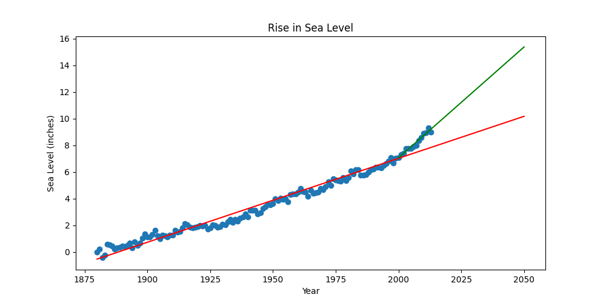

# Sea Level Rise Analysis

This project is part of the **Data Analysis with Python** certification program offered by [freeCodeCamp](https://www.freecodecamp.org/). The goal of this project is to analyze and visualize sea level rise data from the EPA using various statistical and plotting techniques.

## Project Overview

The project involves visualizing sea level data using the following methods:

1. **Scatter Plot**: Displays the relationship between year and sea level.
2. **Line of Best Fit**: Two lines of best fit are created:
    - One for the entire dataset.
    - Another specifically for data from the year 2000 onwards.

## Objectives

- **Understand Data Trends**: Analyze sea level changes over time and identify trends.
- **Visualization Skills**: Apply statistical techniques to visualize and interpret data effectively.
- **Data Analysis**: Enhance skills in data manipulation, statistical analysis, and plotting.

## Files

- `epa-sea-level.csv`: The dataset containing sea level data.
- `sea_level_plot.png`: The generated plot showing the rise in sea level.

## How to Run

1. **Install Required Libraries**: Ensure you have the following Python libraries installed:
    
```bash
pip install pandas matplotlib scipy
```

2. **Run the Jupyter Notebook**:
    
    - Open the notebook file `sea_level_analysis.ipynb` in Jupyter Notebook or JupyterLab.
    - Execute all cells to generate and save the plot.
3. **Check the Output**:
    
    - After running the notebook, the plot will be saved as `sea_level_plot.png` in the same directory.

## Results

The plot includes:

- A scatter plot of the sea level data.
- A red line representing the line of best fit for the entire dataset.
- A green line representing the line of best fit for data from 2000 onwards.




## Impact on Data Science Career

This project allowed me to dive into data analysis and visualization, which are essential for a career in data science. By working with real-world data and applying statistical techniques, I've learned how to better interpret complex datasets and communicate insights. I'm excited about how these new skills will enhance my career prospects and contribute to my growth as a data scientist.